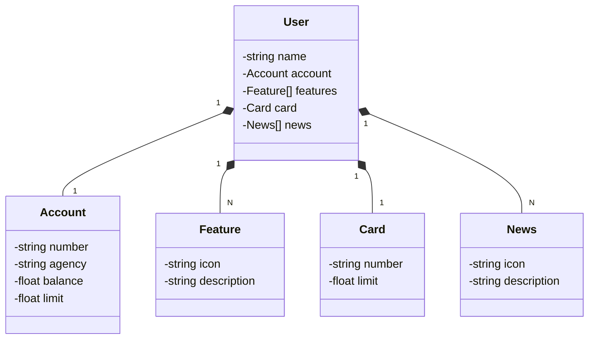

# Java API

## Exercício de Java RESTful API - DIO

### JASON
```
{
  "name": "Venilton",
  "account": {
    "number": "00000000-0",
    "agency": "0000",
    "balance": 1324.64,
    "limit": 1000.00
  },
  "features": [
    {
      "icon": "URL",
      "description": "Descricao da Feature" 
    }
  ],
  "card": {
    "number": "Xxxxx XxXXX XXXX 0000",
    "limit": 1000.00 
  },
  "news": [
    {
      "icon": "URL", 
      "description": "Descrig¢ao da Novidade"
    }
  ]
}
```

### Diagrama


